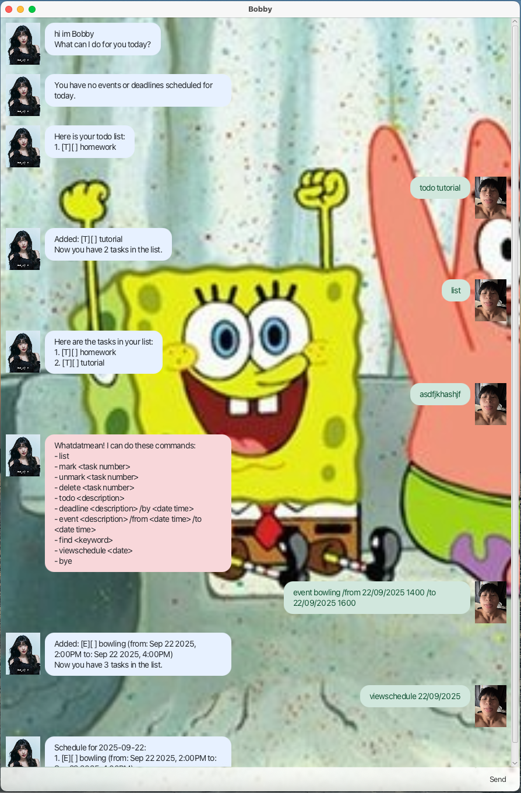

# 🎉 Bobby ChatBot User Guide



> **Bobby** is your friendly, no-nonsense personal task manager chatbot! Add todos, deadlines, and events with natural commands. Bobby keeps your life organized and your tasks safe—automatically!

## 🚀 Features at a Glance

- 📝 Add todos, deadlines, and events
- 📋 List all your tasks
- ✅ Mark and unmark tasks as done
- ❌ Delete tasks you no longer need
- 🔍 Find tasks by keyword
- 📅 View your schedule for a specific date
- 💾 Auto-save and load your data
- 🛑 Red error messages for mistakes

---

## ⏰ Adding deadlines

Add a task with a deadline. The deadline must be in the format `d/M/yyyy HHmm` (e.g., 25/12/2024 1800).

**Usage:**
```
deadline TASK_DESCRIPTION /by DATE_TIME
```
**Example:**
```
deadline Submit report /by 25/12/2024 1800
```
**Outcome:**
> 🆕 Deadline added and shown in your chat window!

---

## 📝 Adding todos

Add a simple todo task with a description.

**Usage:**
```
todo TASK_DESCRIPTION
```
**Example:**
```
todo Read book
```
**Outcome:**
> 🆕 Todo added and shown in your chat window!

---

## 📅 Adding events

Add a task with a start and end time. Both must be in the format `d/M/yyyy HHmm` (e.g., 01/07/2024 1400).

**Usage:**
```
event TASK_DESCRIPTION /from START_DATE_TIME /to END_DATE_TIME
```
**Example:**
```
event Project meeting /from 01/07/2024 1400 /to 01/07/2024 1600
```
**Outcome:**
> 🆕 Event added and shown in your chat window!

---

## 📋 Listing all tasks

Show all your tasks, including todos, deadlines, and events.

**Usage:**
```
list
```
**Outcome:**
> 📃 All tasks are listed in the chat window, with type, status, and details.

---

## ✅ Marking and unmarking tasks

Mark a task as done or not done by its number in the list.

**Usage:**
```
mark TASK_NUMBER
unmark TASK_NUMBER
```
**Example:**
```
mark 2
```
**Outcome:**
> ✨ Task status updated and shown in the chat window!

---

## ❌ Deleting a task

Delete a task by its number in the list.

**Usage:**
```
delete TASK_NUMBER
```
**Example:**
```
delete 3
```
**Outcome:**
> 🗑️ Task deleted and the updated list is shown.

---

## 🔍 Finding tasks

Find and list all tasks containing a given keyword. Keyword matching is case-insensitive and can be partial.

**Usage:**
```
find KEYWORD
```
**Example:**
```
find book
```
**Outcome:**
> 🔎 All matching tasks are shown in the chat window.

---

## 📆 ViewSchedule

See all tasks scheduled for a specific date. The date must be in the format `d/M/yyyy` (e.g., 25/12/2024).

**Usage:**
```
viewschedule DATE
```
**Example:**
```
viewschedule 25/12/2024
```
**Outcome:**
> 📅 All tasks scheduled for that date are shown in the chat window.

---

## 🚪 Exiting the application

Close Bobby and save your tasks.

**Usage:**
```
bye
```
**Outcome:**
> 👋 The application closes after a short delay. Your data is safe!

---

## 📝 Command format notes

- Words in **UPPER_CASE** are parameters to be supplied by the user.  
  Example: `deadline TASK_DESCRIPTION /by DATE_TIME`
- Parameters can be in any order.
- Extraneous parameters for commands that do not take in parameters will be ignored.

> **Tip:** Use the correct date/time format to avoid errors. Bobby will let you know if something's off!

---

## 🛑 Error handling

> **Bobby will show errors in a dialog box if your command is invalid or data is incorrect.**
>
> Examples: missing parameters, invalid dates, duplicate tasks, file issues, or invalid task numbers.

---

## 💾 Saving data

- Your tasks are saved automatically and loaded the next time you start Bobby.

---

**Ready to get organized? Start chatting with Bobby now! 🎉**
